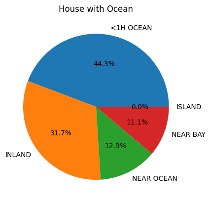
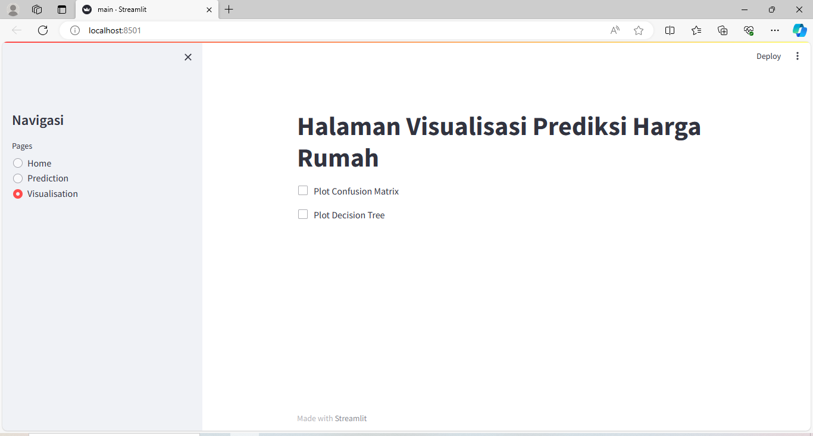

# Laporan Proyek Machine Learning
### Nama    : Shiva Amalia Setiawan
### Nim     : 211351139
### Kelas   : Teknik Informatika Pagi A

## Domain Proyek

California Housing Price atau Harga Rumah California dimana data ini bertujuan untuk memberikan gambaran yang detail mengenai harga rumah di California, memberikan informasi berharga bagi calon pembeli rumah yang ingin berada di dekat laut ataupun dekat teluk untuk membuat keputusan berdasarkan preferensi dan keinginan pribadi mereka di pasar perumahan California.

## Business Understanding

Harga rumah di California telah mengalami kenaikan yang signifikan dalam beberapa tahun terakhir. Kenaikan harga rumah di California disebabkan oleh beberapa faktor, termasuk permintaan yang tinggi, pasokan yang rendah, dan inflasi. 

Bagian laporan ini mencakup :

### Problem Statements

Kenaikan harga rumah di California telah membuat menjadi semakin sulit bagi orang-orang untuk membeli rumah. Untuk memudahkan seseorang melihat kisaran harga rumah di California, diperlukan solusi yang memenuhi kebutuhan pengguna seperti menggunakan aplikasi seluler dapat menyediakan informasi tentang harga rumah di California dan platform pemesanan online dapat digunakan untuk membandingkan harga rumah dari berbagai agen. Dengan solusi yang tepat, maka akan lebih mudah bagi seseorang untuk melihat kisaran harga rumah di California.

### Goals

Kemudahan dan kenyamanan untuk pembeli atau pendatang untuk menentukan serta memperhitungkan harga serta letak yang pas untuk membeli sebuah rumah di California


### Solution statements

- Mengembangkan platform Estimasi harga Trip Yellow Taxi yang terintegrasi dengan Kaggle.com guna memberikan akses yang cepat dan mudah tentang informasi kisaran harga rumah yang berada di California. platform ini menyediakan antarmuka yang mudah dimana kita dapat mengetahui harga rumah dengan aman dan mudah dengan sebuah paltform online tersebut, selain itu juga dengan adanya platform online ini kita bisa mengetahui rata-rata umur rumah, total ruangan, total kamar, serta rata-rata harga rumah yang berad di dekat laut di california. Dengan solusi ini, kami bertujuan untuk menciptakan kenyamanan bagi orang-orang ataupun pendatang yang ingin membeli rumah di California.

- Model yang dihasilkan dari dataset ini menggunakan metode DecisionTreeClassifier.

## Data Understanding

Data yang digunakan yaitu Datasets yang berasal dari Kaggle dimana pada Kaggle ini memiliki sekumpulan data tentang Harga Rumah California, didalam datasets tersebut memiliki 20640 data.

[California Housing Price](https://www.kaggle.com/datasets/camnugent/california-housing-prices)


### Variabel-variabel pada California Housing Prices Dataset adalah sebagai berikut:

1. **longitude (Bujur)** (float64) : Ukuran seberapa jauh ke arah barat sebuah rumah; nilai yang lebih tinggi berarti lebih jauh ke arah barat
2. **latitude (garis lintang)** (float64) : Ukuran seberapa jauh ke utara sebuah rumah; nilai yang lebih tinggi berarti lebih jauh ke utara
3. **housingMedianAge (Rata-rata umur rumah)** (float64 ): Usia rata-rata rumah dalam satu blok; angka yang lebih rendah adalah bangunan yang lebih baru
4. **totalRooms (totalruangan)** (float64) : Jumlah total ruangan dalam satu blok
5. **totalBedrooms (totalKamarTidur)** (float64) : Jumlah total kamar tidur dalam satu blok
6. **population (populasi)** (float64) : Jumlah total orang yang tinggal di dalam satu blok
7. **households (rumah tangga)** (float64) : Jumlah total rumah tangga, sekelompok orang yang tinggal di dalam unit rumah, untuk satu blok
8. **medianIncome (medianPendapatan)** (float64) : Pendapatan rata-rata untuk rumah tangga dalam satu blok rumah (diukur dalam puluhan ribu Dolar AS)
9. **medianHouseValue (medianNilaiRumah)** (float64) : Nilai rumah rata-rata untuk rumah tangga dalam satu blok (diukur dalam Dolar AS)
10. **oceanProximity** (objek) : Lokasi rumah dengan samudra/laut

## Data Collection

Data collection ini saya dapat dari dataset yang nantinya digunakan dari website kaggle dengan nama dataset California Housing Price dengan file housing.csv

## Data Discovery And Profiling

Pada bagian ini kita menggunkan metode DessicionTree dan EDA.

Pertama karena saya menggunakan google colab untuk mengerjakannya, maka kita akan import file lalu mengupload token kaggle.json dari kaggle agar bisa mendownload dataset yang kita inginkan dari kaggle melalui oogle colab.

```jupiter
from google.colab import files
files.upload()
```
setelah mengupload filenya, maka kita akan membuat sebuah folder untuk menyimpan file kaggle.json yang sudah di upload.
```jupiter
!mkdir -p ~/.kaggle
!cp kaggle.json ~/.kaggle/
!chmod 600 ~/.kaggle/kaggle.json
!ls ~/.kaggle
```

Pertama kita import library yang dibutuhkan,
```jupiter
import pandas as pd
import numpy as np
import matplotlib.pyplot as plt
import seaborn as sns
from sklearn.model_selection import train_test_split
from sklearn.tree import DecisionTreeClassifier
from sklearn.metrics import confusion_matrix, accuracy_score
```

Tahap selanjutnya yaitu memanggil dataset yang kita inginkan dari website kaggle untuk didownload di google colab.
```jupiter
!kaggle datasets download -d camnugent/california-housing-prices
```

Selanjutnya kita akan melakukan extract data untuk menampilkan file yang kita inginkan.
```jupiter
!mkdir california-housing-prices
!unzip california-housing-prices.zip -d california-housing-prices
!ls california-housing-prices
```

Selanjutnya mari kita import library yang dibutuhkan
```jupiter
import pandas as pd
import numpy as np
import matplotlib.pyplot as plt
import seaborn as sns
from sklearn.model_selection import train_test_split
from sklearn.tree import DecisionTreeClassifier
from sklearn.metrics import confusion_matrix, accuracy_score
```

Selanjutnya kita create data yang kita inginkan.
```jupiter
df = pd.read_csv("/content/california-housing-prices/housing.csv")
```

Setelah itu mari kita lihat dataset kita,
```jupiter
df.sample()
```

```jupiter
df.info()
```


karena dataset yang saya dapat berupa float64 maka dari itu saya ingin ubah menjadi int64
```jupiter
numerical = []
catgcols = []

for col in df.columns:
    if df[col].dtype == "float64" or df[col].dtype == "int64":
        numerical.append(col)
    else:
        catgcols.append(col)

for col in df.columns:
    if col in numerical:
        df[col].fillna(df[col].median(), inplace=True)
    else:
        df[col].fillna(df[col].mode()[0], inplace=True)
```

Selanjutnya mari kita lihat data yang sudah diubah bersifat numerical dan catgcols
```jupiter
numerical
```

```jupiter
catgcols
```


setelah itu mari kita lihat datanya
```jupiter
df.head()
```


## EDA

Selanjutnya mari kita lihat datasetnya terdapat baris yang kosong atau null dengan menggunakan seaborn.
```jupiter
sns.heatmap(df.isnull())
```


Selanjutnya mari kita lihat menggunakan heatmap apakah data tersebut bagus atau tidak.
```jupiter
plt.figure(figsize=(10,8))
sns.heatmap(df.corr(),annot=True)
```

okee, luamayan.

Selanjutnya kita tampilkan data pada tabel dengan menggunakan grafik.
```jupiter
df.hist(bins=50, figsize=(20,15))
plt.show()
```

bisa dilihat bahwa setiap data yang ada pada masing-masing tabel memiliki kecenderungan jumlah data yang berbeda serta dapat menampilkan hasil yang berbeda juga.

Selanjutnya kita akan menampilkan data populasi di california
```jupiter
df.plot(kind='scatter', x='longitude', y='latitude',
             alpha=0.2, figsize = (5,3), grid = True,
             s=df['population']/100, label = 'population',
             c='median_house_value', cmap=plt.get_cmap('jet'), colorbar=True)
plt.show()
```

dapat dilihat bahwa populasi di California cukup lumayan dengan membandingan dengan rata-rata nilai rumah dengan bujur dan garis lintang.

Selanjutnya akan menampilkan jumlah persen jika rumah yang berada di California berdekatan dengan laut atau tidak dengan mengunakan diagram pie.
```jupiter
x = df['ocean_proximity'].value_counts()
plt.pie(x,labels=['<1H OCEAN','INLAND','NEAR OCEAN','NEAR BAY','ISLAND'],autopct="%1.1f%%")
plt.title('House with Ocean')
plt.show()
```

bisa dilihat bahwa 44.3% rumah berada di laut
pedalaman berjumlah 31.7%
dekat laut berjumlah 12.9%
dekat teluk berjumlah 11.1%
pulau berjumlah 0%

Selanjutnya menampilkan plot dengan membandingkantotal rooms dengan population dan housland.
```jupiter
df.plot(x="total_rooms", y=[ 'population',"households"])
plt.show()
```


## Data Preparition
pada saat ini mari lakukan yang sama yaitu create dataset
```jupiter
df.to_csv('housing.csv')
```
setelah itu saya akan melakukan transformasi data
```jupiter
from sklearn.preprocessing import LabelEncoder

le = LabelEncoder()

for col in catgcols:
  df[col] = le.fit_transform(df[col])
```
disini saya melakukan transformasi pada data ocean_proximity dimana data sebelumnya bersifat objek diubah menjadi int
```jupiter
df['ocean_proximity'] = le.fit_transform(df['ocean_proximity'])
```
lalu menentukan x dan y
```jupiter
x = df[ind_col] #feature
y = df[dep_col] #label
```
mari kita lihat hasil data yang diubah
```jupiter
df.head()
```


setelah itu data pada ocean_proximity juga berubah
```jupiter
df['ocean_proximity'].value_counts()
```


## Modeling

Selanjutnya mari kita seleksi kolom-kolom fitur yang ada di dataset dan juga untuk kita tampilkan pada web,
```jupiter
features = ['longitude','latitude',	'housing_median_age',	'total_rooms',	'total_bedrooms',	'population',	'households',	'median_income',	'median_house_value']
x = df[features]
y = df['ocean_proximity']
x.shape, y.shape
```
Selanjutnya kita tentukan beberapa dataset yang akan diguakan untuk test dan untuk train,
```jupiter
from sklearn.model_selection import train_test_split

x_train, x_test, y_train, y_test = train_test_split(x, y, test_size=0.20, random_state=50)
```
Disini karena saya menggunakan metode DecisionTree, maka saya akan meng import DecisionTreeClassifier terlebih dahulu lalu Selanjutnya mari kita lihat akurasi training, akurasi testing, serta score dari model kita,
```jupiter
from sklearn.metrics import accuracy_score, confusion_matrix, classification_report
from sklearn.tree import DecisionTreeClassifier

# Assuming you have defined x_train, y_train, x_test, and y_test

dtc = DecisionTreeClassifier(
    ccp_alpha=0.0, class_weight=None, criterion='entropy',
    max_depth=4, max_features=None, max_leaf_nodes=None,
    min_impurity_decrease=0.0, min_samples_leaf=1,
    min_samples_split=2, min_weight_fraction_leaf=0.0,
    random_state=42, splitter='best'
)

model = dtc.fit(x_train, y_train)

dtc_acc = accuracy_score(y_test, dtc.predict(x_test))

print(f"Akurasi data training = {accuracy_score(y_train, dtc.predict(x_train))}")
print(f"Akurasi data testing = {dtc_acc} \n")

print(f"Confusion matrix : \n {confusion_matrix(y_test, dtc.predict(x_test))}\n")
confusion = confusion_matrix(y_test, dtc.predict(x_test))
print(f"Classification report : \n {classification_report(y_test, dtc.predict(x_test))}")
```

Cukup besar, dimana :
Akurasi data training = 0.856952519379845
Akurasi data testing = 0.8573158914728682 
serta nilai Accuracynya yaitu 0.86 atau 86%

Selanjutnya mari kita coba dengan memasukan nilai dari data yang telah digunakan.
```jupiter
import numpy as np

input_data = (-118.41,	34.04,	49.0,	601.0,	95.0,	228.0,	106.0,	8.0239,	500001.0)

input_data_as_numpy_array = np.array(input_data)

input_data_reshape = input_data_as_numpy_array.reshape(1, -1)

prediction = model.predict(input_data_reshape)
print(prediction)

if prediction[0] == 0:
    print('Pembeli membeli rumah dekat Laut')
else:
    print('Pembeli membeli rumah tidak dekat Laut')
```


### Visualisasi dari model

Lalu pada tahap ini saya menggunakan metode DessicionTree maka saya akan menampilkan pohon keputusan dari data yang telah diolah
```jupiter
from sklearn import tree
import matplotlib.pyplot as plt

plt.figure(figsize=(60,30))
tree.plot_tree(
    model,
    feature_names=ind_col,
    class_names=['<1H OCEAN', 'INLAND', 'NEAR OCEAN ', 'NEAR BAY ', 'ISLAND'],
    filled=True
)
plt.show()
```

Woow, cukup banyaaakk.


Setelah itu mari kita export sebagai sav.
```jupiter
import pickle
filename = "california_house.sav"
pickle.dump(model, open(filename, 'wb'))
```

## Evaluation

Pada evaluasi ini, saya menggunakan metode Classification Report.
Classification report yaitu sebuah laporan yang menyajikan metrik evaluasi kinerja dari suatu model klasifikasi dalam konteks machine learning atau data mining. Classification report menyediakan gambaran komprehensif tentang performa model klasifikasi, membantu pemahaman tentang kekuatan dan kelemahan model tersebut dalam menghadapi dataset tertentu.

- Precision (Presisi): Merupakan rasio antara observasi positif yang diprediksi dengan benar terhadap total observasi yang diprediksi positif. Precision mengukur seberapa tepat model dalam memprediksi kelas positif.

- Recall (Recall, Sensitivitas, atau True Positive Rate): Merupakan rasio antara observasi positif yang diprediksi dengan benar terhadap total observasi positif sebenarnya. Recall mengukur kemampuan model dalam menangkap semua instans yang relevan dari suatu kelas.

- F1-Score: Merupakan nilai rata-rata harmonis antara precision dan recall. F1-score memberikan ukuran seimbang dari kinerja model, terutama ketika distribusi kelas tidak seimbang.

- Support: Merupakan jumlah kemunculan aktual dari suatu kelas dalam dataset. Ini membantu untuk memahami distribusi kelas dalam dataset.

Dari hasil Classification Report yang berhasil ditampilkan dapat dijelaskan sebagai berikut :
1. Precision(presisi) Merupakan rasio antara observasi positif yang diprediksi dengan benar terhadap total observasi yang diprediksi positif. Precision mengukur seberapa tepat model dalam memprediksi kelas positif.
    - Untuk kelas 0 atau <1H OCEAN presisi adalah 0.90, yang berarti 90%
    - Untuk kelas 1 atau INLAND presisi adalah 0.92, yang berarti 92%
    - Untuk kelas 2 atau NEAR OCEAN presisi adalah 0.00, yang berarti 0%
    - Untuk kelas 3 atau NEAR BAY presisi adalah 0.82, yang berarti 82%
    - Untuk kelas 4 atau ISLAND presisi adalah 0.63, yang berarti 63%
2. Recall Merupakan rasio antara observasi positif yang diprediksi dengan benar terhadap total observasi positif sebenarnya.
    - Untuk kelas 0 atau <1H OCEAN recal adalah 0.85, yang berarti 85%
    - Untuk kelas 1 atau INLAND recall adalah 0.90, yang berarti 90%
    - Untuk kelas 2 atau NEAR OCEAN recall adalah 0.00, yang berarti 0%
    - Untuk kelas 3 atau NEAR BAY recall adalah 0.98, yang berarti 98%
    - Untuk kelas 4 atau ISLAND recall adalah 0.68, yang berarti 68%
3. F1-Score: Merupakan nilai rata-rata harmonis antara precision dan recall. Sama seperti sebelumnya pada F1-Score tidak jauh beda, disetiap kelas memiliki nilai yang berbeda seperti pada kelas 0 atau <1H OCEAN terdapat hasil 0.87 atau 87% begitu juga dengan kelas yang lainnya.
4. Support Merupakan jumlah kemunculan aktual dari suatu kelas dalam dataset. Pada support tiap kelas juga berbeda nilainya dimana pada kelas 1 atau INLAND nilai support yang didapat adalah 1881 begitu juga yang lainnya.
5. Accuracy (Akurasi) adalah suatu metrik evaluasi kinerja yang mengukur sejauh mana suatu model klasifikasi dapat membuat prediksi yang benar dari total prediksi yang dilakukan. Ini adalah rasio antara jumlah prediksi yang benar (TruePositives dan TrueNegatives) dengan total jumlah observasi atau instans dalam dataset. Dalam kasus ini nilai akurasi yang didapat yaitu 0.86 atau 86%.


## Deployment

[Streamlit-california_housing](https://app-californiahousing.streamlit.app/)





